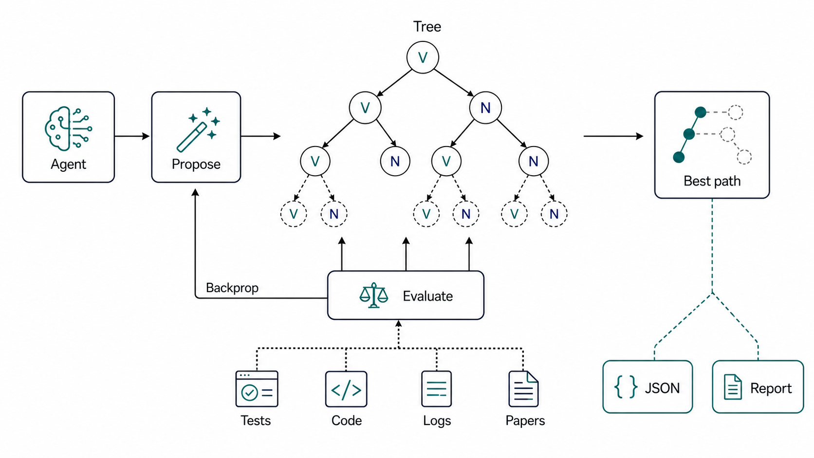
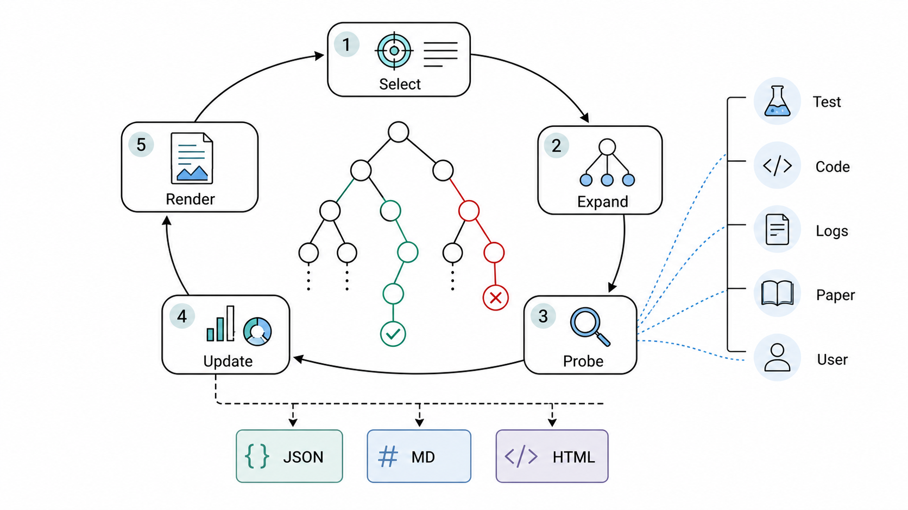

# MindMap-MCTS

Evidence-guided reasoning trees for Codex and Claude Code agents.



MindMap-MCTS is an installable Codex skill and Claude Code skill pattern for complex debugging, architecture decisions, and research synthesis. It turns agent reasoning into an auditable reasoning tree: propose branches, run real probes, score evidence, backpropagate values, and choose the next step with lightweight Monte Carlo Tree Search (MCTS) and UCB.

In short: this gives AI agents a visible tree search loop instead of a hidden linear trial-and-error thread.

## Search Keywords

Codex skill, Claude Code skill, AI agents, agentic AI, agent reasoning, reasoning tree, evidence-guided reasoning, tree search, Monte Carlo Tree Search, MCTS, UCB, debugging workflow, planning workflow, architecture tradeoffs, research synthesis.

中文摘要：MindMap-MCTS 给 Codex、Claude Code 和其他智能体安装一个可见的推理树，让复杂问题可以用“分支探索、证据评分、MCTS/UCB 选择、回传更新”的方式推进，而不是线性瞎试。

## What It Does

- Creates a JSON reasoning tree as the truth source.
- Renders readable Markdown and static HTML mindmap views.
- Selects the next branch with lightweight MCTS/UCB.
- Records `V` value, `N` visits, state, probe metadata, and evidence per node.
- Preserves pruned branches so dead ends are not retried.
- Helps agents stop when a high-evidence path converges or when a user decision is needed.



## Alpha-Style Search Architecture

MindMap-MCTS turns Codex problem solving into a compact search architecture:

| Alpha-style component | MindMap-MCTS counterpart |
| --- | --- |
| Policy-like proposal | Codex proposes concrete hypotheses, designs, or next actions. |
| Search tree | `.tree.json` stores branches, states, visits, values, and evidence. |
| Value signal | Probe-backed evidence scores come from tests, logs, code reads, papers, or user input. |
| Backpropagation | The CLI updates `V/N` along the selected path after evaluation. |
| Best action | `next` and `path` expose the strongest branch for the next Codex step. |

The result is an Alpha-inspired skill implementation: the language model supplies candidate moves and real-world probes; the deterministic CLI preserves the tree, scores branches, and renders an auditable reasoning map.

This project is not affiliated with Google, DeepMind, AlphaGo, AlphaZero, AlphaFold, or any official Alpha-series project.

## Repository Layout

```text
mindmap-mcts-skill/
  mindmap-mcts/              # Installable Codex skill folder
    SKILL.md
    agents/openai.yaml
    scripts/mindmap_mcts/    # Bundled CLI tree engine
  examples/                  # Example tree state and rendered view
  docs/                      # Design notes and implementation plan
  assets/                    # GitHub README illustrations
  tests/                     # CLI and engine tests
```

## Install

Clone this repository and run the installer:

```bash
git clone git@github.com:cheshireyang/mindmap-mcts-skill.git
cd mindmap-mcts-skill
./install.sh
```

Restart Codex so the new skill metadata is loaded.

Manual install is also just a directory copy:

```bash
mkdir -p "${CODEX_HOME:-$HOME/.codex}/skills"
cp -R mindmap-mcts "${CODEX_HOME:-$HOME/.codex}/skills/"
```

## Use In Codex

Ask Codex to use the skill explicitly:

```text
Use $mindmap-mcts to explore this debugging task: login sometimes times out under load.
```

or:

```text
用 $mindmap-mcts 分析这个复杂问题：Transformer 当前有哪些缺陷？
```

## Use The Bundled CLI Directly

The skill includes a Python CLI under `mindmap-mcts/scripts`.

```bash
mindmap-mcts/scripts/mindmap --help
```

Create and inspect a tree:

```bash
mindmap-mcts/scripts/mindmap init \
  --title "Fix intermittent login timeout" \
  --out task.tree.json

mindmap-mcts/scripts/mindmap add task.tree.json \
  --parent n1 \
  --type hypothesis \
  --content "DB connection pool is exhausted"

mindmap-mcts/scripts/mindmap eval task.tree.json \
  --id n2 \
  --value 0.9 \
  --evidence "Logs contain pool timeout during failed login" \
  --probe-type log \
  --source logs/auth.log \
  --confidence high

mindmap-mcts/scripts/mindmap backprop task.tree.json --from n2
mindmap-mcts/scripts/mindmap render task.tree.json --out task.tree.md
mindmap-mcts/scripts/mindmap render-html task.tree.json --out task.tree.html
mindmap-mcts/scripts/mindmap show task.tree.json
mindmap-mcts/scripts/mindmap path task.tree.json
mindmap-mcts/scripts/mindmap next task.tree.json
mindmap-mcts/scripts/mindmap doctor task.tree.json
```

Available commands:

```text
init, add, eval, prune, select, backprop, render, render-html, show, path, next, doctor
```

Structured evidence fields are optional. Use them when a score is backed by a concrete probe:

```bash
--probe-type test|grep|log|paper|code-read|user-input
--source path/to/file.py:42
--confidence low|medium|high
```

## Example

See [examples/login-timeout.tree.md](examples/login-timeout.tree.md):

```text
Best path: n1 -> n2
Best value: 0.90
```

## When To Use

Use this skill when a task has:

- multiple plausible hypotheses or designs
- systematic debugging needs
- repeated trial-and-error risk
- option tradeoffs that should remain visible
- evidence-backed exploration rather than pure speculation

Skip it for one-step commands, obvious edits, or direct fact lookups.

## Development

Run tests from the repository root:

```bash
PYTHONPATH=mindmap-mcts/scripts pytest tests -q
```

Validate the skill folder with Codex's skill validator:

```bash
python3 ~/.codex/skills/.system/skill-creator/scripts/quick_validate.py mindmap-mcts
```

Skill evaluation prompts live in [evals/evals.json](evals/evals.json). They cover debugging, architecture tradeoffs, and research synthesis, and are intended to compare agent behavior with and without `$mindmap-mcts`.

## License

MIT
