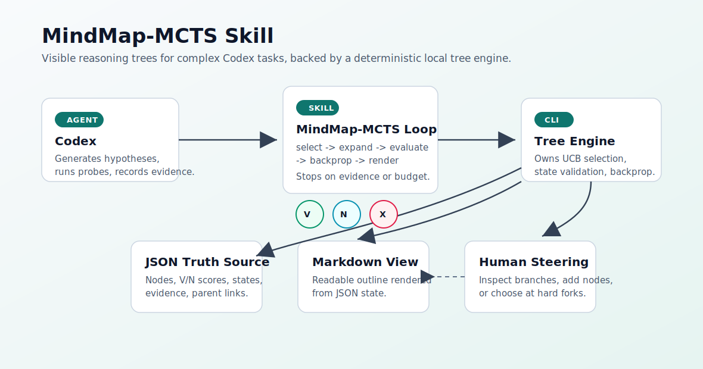
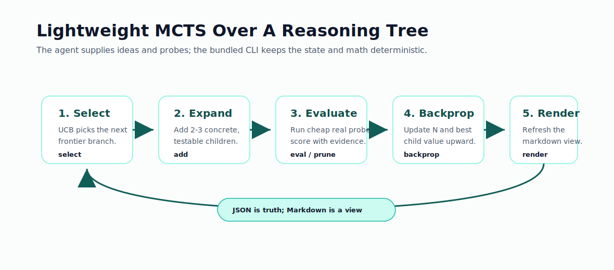

# MindMap-MCTS Skill

Visible reasoning trees for complex Codex tasks.



MindMap-MCTS is a Codex skill with a bundled Python CLI. It keeps complex debugging, design, and research tasks on an explicit tree instead of a hidden linear thread. Codex expands hypotheses and runs real probes; the CLI owns deterministic tree state, UCB selection, backpropagation, and Markdown rendering.

## What It Does

- Creates a JSON reasoning tree as the truth source.
- Renders a readable Markdown mindmap view.
- Selects the next branch with lightweight MCTS/UCB.
- Records `V` value, `N` visits, state, and evidence per node.
- Preserves pruned branches so dead ends are not retried.
- Helps agents stop when a high-evidence path converges or when a user decision is needed.



## Repository Layout

```text
mindmap-mcts-skill/
  mindmap-mcts/              # Installable Codex skill folder
    SKILL.md
    agents/openai.yaml
    scripts/mindmap_mcts/    # Bundled CLI tree engine
  examples/                  # Example tree state and rendered view
  docs/                      # Design notes and implementation plan
  assets/                    # GitHub README illustrations
  tests/                     # CLI and engine tests
```

## Install

Clone this repository and run the installer:

```bash
git clone git@github.com:cheshireyang/mindmap-mcts-skill.git
cd mindmap-mcts-skill
./install.sh
```

Restart Codex so the new skill metadata is loaded.

Manual install is also just a directory copy:

```bash
mkdir -p "${CODEX_HOME:-$HOME/.codex}/skills"
cp -R mindmap-mcts "${CODEX_HOME:-$HOME/.codex}/skills/"
```

## Use In Codex

Ask Codex to use the skill explicitly:

```text
Use $mindmap-mcts to explore this debugging task: login sometimes times out under load.
```

or:

```text
用 $mindmap-mcts 分析这个复杂问题：Transformer 当前有哪些缺陷？
```

## Use The Bundled CLI Directly

The skill includes a Python CLI under `mindmap-mcts/scripts`.

```bash
mindmap-mcts/scripts/mindmap --help
```

Create and inspect a tree:

```bash
mindmap-mcts/scripts/mindmap init \
  --title "Fix intermittent login timeout" \
  --out task.tree.json

mindmap-mcts/scripts/mindmap add task.tree.json \
  --parent n1 \
  --type hypothesis \
  --content "DB connection pool is exhausted"

mindmap-mcts/scripts/mindmap eval task.tree.json \
  --id n2 \
  --value 0.9 \
  --evidence "Logs contain pool timeout during failed login"

mindmap-mcts/scripts/mindmap backprop task.tree.json --from n2
mindmap-mcts/scripts/mindmap render task.tree.json --out task.tree.md
mindmap-mcts/scripts/mindmap show task.tree.json
```

Available commands:

```text
init, add, eval, prune, select, backprop, render, show
```

## Example

See [examples/login-timeout.tree.md](examples/login-timeout.tree.md):

```text
Best path: n1 -> n2
Best value: 0.90
```

## When To Use

Use this skill when a task has:

- multiple plausible hypotheses or designs
- systematic debugging needs
- repeated trial-and-error risk
- option tradeoffs that should remain visible
- evidence-backed exploration rather than pure speculation

Skip it for one-step commands, obvious edits, or direct fact lookups.

## Development

Run tests from the repository root:

```bash
PYTHONPATH=mindmap-mcts/scripts pytest tests -q
```

Validate the skill folder with Codex's skill validator:

```bash
python3 ~/.codex/skills/.system/skill-creator/scripts/quick_validate.py mindmap-mcts
```

## License

MIT
